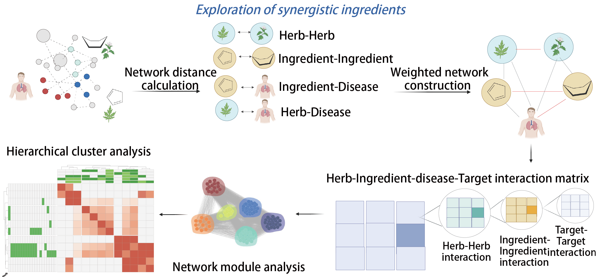

# HerbSyner_Finder

A General Tool for Synergistic Ingredient Discovery in Herbal Medicine

## Overview

HerbSyner_Finder is a computational pipeline designed to discover synergistic ingredient combinations in herbal medicine using network-based approaches and community detection algorithms. This tool helps identify key therapeutic modules and potential synergistic herb combinations for specific diseases through advanced network analysis.

<p align="center">
  
  <br>
  <em>Overview of network framework. (A) Systematic comparison of five prescriptions for CVA on their therapeutic targets. (B) Identify synergistic ingredients of CVA prescriptions through a comprehensive combination landscape (C) Experimental validation of synergistic ingredients.</em>
</p>

## Features

- **Network-based distance calculation**: Compute distances between herbs and ingredients in biological networks
- **Community detection**: Identify communities in herb-ingredient-disease networks using Louvain algorithm
- **Key module identification**: Detect synergistic modules with main therapeutic effects
- **ADMET property filtering**: Filter ingredients based on drug-likeness properties
- **Multi-disease support**: Analyze multiple disease targets simultaneously
- **Visualization tools**: Generate comprehensive synergy landscapes

## Installation

### Prerequisites

- Python 3.10.11
- Required Python packages:

```bash
pip install communities==2.1.1
pip install networkx==2.8.4
pip install scikit-learn==1.2.2
pip install pandas numpy matplotlib seaborn openpyxl
```

Install from PyPI

```bash
pip install herbSyner_Finder
Install from Source
```


# Clone the repository
```bash
git clone https://github.com/[username]/herbSyner_Finder.git
cd herbSyner_Finder
```

# Install the package
```bash
pip install -e .

```

## Quick Start

### 1. Import Required Modules
```python
import pickle
import networkx as nx
import pandas as pd
import herbSyner_Finder
from herbSyner_Finder import Herb_Comb_Community
from herbSyner_Finder import Detection_key_Module_multiple
from herbSyner_Finder import herb_synergy_landscape
from herbSyner_Finder import generate_objects
```


## Complete Example Code

### 2. Load packages and Data Objects
```python
import
 pickle
import networkx as nx
import pandas as pd
import herbSyner_Finder
from herbSyner_Finder import Herb_Comb_Community
from herbSyner_Finder import Detection_key_Module_multiple
from herbSyner_Finder import herb_synergy_landscape
from herbSyner_Finder import generate_objects

# Load data objects
g_obj, ingredients_obj, herb_obj, herb_info, fangji, disease_obj, herb_distance_obj = generate_objects.load_obj_data()

# Set save path
save_path = "result"

# Define file paths
HIf = 'result/herb_ingredient_pairs_pd.csv'
HHf = 'result/herb_herb_dis_pd.csv'
IIf = 'result/ingre_ingre_dis_pd.csv'
DHf = 'result/herb_disease_pd.csv'
DIf = 'result/herb_disease_ingre_pd.csv'
disease_name = "Cough Variant Asthma"
```

### Step 1: Calculate network distance
```python
disease_list = ['Cough Variant Asthma']

# Use herb pair 'MA HUANG','ZI SU YE' as example
combination_herb_list=['MA HUANG','ZI SU YE']

herb_list, herb_herb_dis, ingre_ingre_dis, herb_ingre_pairs = herb_synergy_landscape.cal_combination_distance(herb_info,combination_herb_list)

# Here we use random time = 1 as example to save time
herb_disease_pd, herb_disease_ingre_pd = herb_synergy_landscape.cal_combination_disease(herb_list, herb_distance_obj, disease_list, random_time=1)

# Save distance data from example as files
herb_herb_dis.to_csv('result/herb_herb_distance_example.csv', index=None) 
ingre_ingre_dis.to_csv('result/ingre_ingre_distance_example.csv', index=None)
herb_ingre_pairs.to_csv('result/herb_ingredient_pairs_example.csv', index=None)
herb_disease_pd.to_csv('result/herb_disease_pd_example.csv', index=None)
herb_disease_ingre_pd.to_csv('result/herb_disease_ingre_pd_example.csv', index=None)
```

### Step 2: Calculate the communities for the complex landscape between herbs
```python
# Reload data generated by step 1
HH = pd.read_csv(HHf).drop_duplicates()
II = pd.read_csv(IIf).drop_duplicates()
DH = pd.read_csv(DHf).drop_duplicates()
DI = pd.read_csv(DIf).drop_duplicates()
ADMETf = 'source_data/ingredient_ADMET_Properties.xlsx'
ADMET = pd.read_excel(ADMETf).drop_duplicates()
```

### step 3. Detect herb communities
```python
herb_commuties_case_obj = Herb_Comb_Community(HH, II, DH, DI, disease_name)
G, communities, DHI_result, subset_data_I, subset_data_H, node_detect_df = herb_commuties_case_obj.get_herb_communities(ADMET_filter = True)

## Essential Data Files:

Herb-Ingredient Pairs (herb_ingredient_pairs_pd.csv): Mapping between herbs and their chemical ingredients

Herb-Herb Distances (herb_herb_dis_pd.csv): Network distances between herb pairs

Ingredient-Ingredient Distances (ingre_ingre_dis_pd.csv): Network distances between ingredient pairs

Herb-Disease Associations (herb_disease_pd.csv): Herb-disease therapeutic relationships

Herb-Disease-Ingredient Associations (herb_disease_ingre_pd.csv): Detailed associations between herbs, ingredients, and diseases
```


## Dependencies
communities 2.1.1: Community detection algorithms (GitHub)

networkx 2.8.4: Network analysis and graph operations

scikit-learn 1.2.2: Machine learning utilities

pandas: Data manipulation and analysis

numpy: Numerical computations

matplotlib/seaborn: Visualization

jupyter: For running example notebooks

tqdm: For progress bars in lengthy computations


## References
Communities package documentation

NetworkX documentation: https://networkx.org/

Scikit-learn documentation: https://scikit-learn.org/

